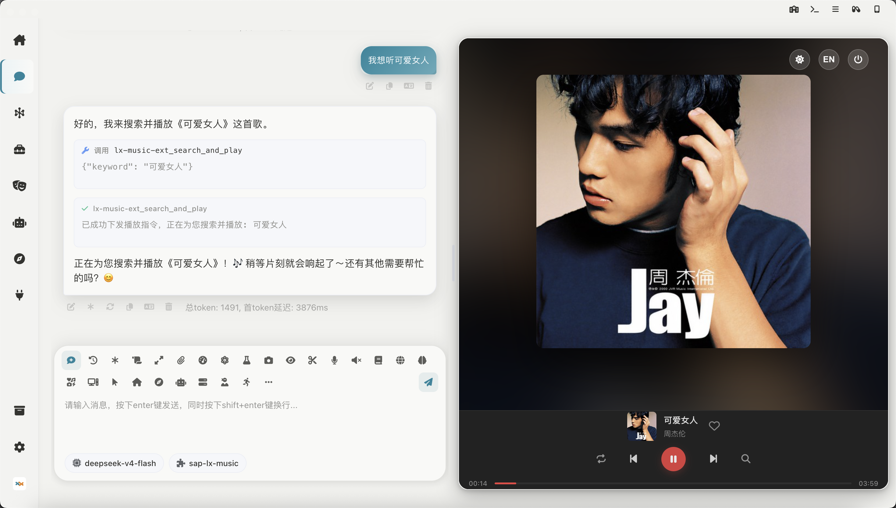

# sap-lx-music

**AI伴侣的落雪音乐控制器扩展**

**LX Music Controller Extension for AI Companion**

---

## ⚠️ 法律与合规声明

> **本项目的法律定位**
>
> 本插件是已安装并运行的[落雪音乐(LX Music)](https://github.com/lyswhut/lx-music-desktop)软件的**外部控制工具**，而非音乐播放器本身。

**1. 本项目不提供任何音乐内容**
- 不内置、不携带、不代理、不解析任何音乐文件或音乐源
- 仅发送本地HTTP控制指令（播放/暂停/切歌等）至落雪音乐

**2. 完全依赖第三方软件**
- 用户**必须自行安装并配置**落雪音乐软件
- 用户**必须自行开启**落雪音乐的"开放API服务"
- 用户**必须自行管理**音源配置

**3. 用户责任**
- 用户需确保其使用落雪音乐及相关音源的行为，符合落雪音乐的用户协议及当地法律法规
- 用户对通过落雪音乐播放的任何音乐内容承担全部法律责任

**4. 开发者免责**
- 本插件开发者不对用户通过落雪音乐播放的任何音乐内容的合法性负责
- 开发者不承担因用户使用本插件或落雪音乐所产生的任何法律纠纷责任

---

**使用本插件即表示您已阅读、理解并同意上述全部条款。**

---

## ⚠️ Legal & Compliance Notice

> **Legal Status of This Project**
>
> This extension is an **external control tool** for an already installed and running instance of [LX Music](https://github.com/lyswhut/lx-music-desktop), NOT a music player itself.

**1. This Project Provides NO Music Content**
- Does NOT bundle, host, proxy, parse, or distribute any music files or audio sources
- Only sends local HTTP control commands (play/pause/next, etc.) to LX Music

**2. Fully Dependent on Third-Party Software**
- Users **MUST install and configure** LX Music themselves
- Users **MUST enable** the "Open API Service" in LX Music settings
- Users **MUST manage** their own audio sources/configurations

**3. User Responsibility**
- Users are solely responsible for ensuring their use of LX Music and any audio sources complies with LX Music's user agreement and applicable laws
- Users bear full legal responsibility for any music content played through LX Music

**4. Developer Disclaimer**
- This extension's developer does NOT warrant the legality of any music content played by users through LX Music
- The developer assumes NO liability for any legal disputes arising from the use of this extension or LX Music

---

**By using this extension, you acknowledge that you have read, understood, and agreed to all of the above terms.**
